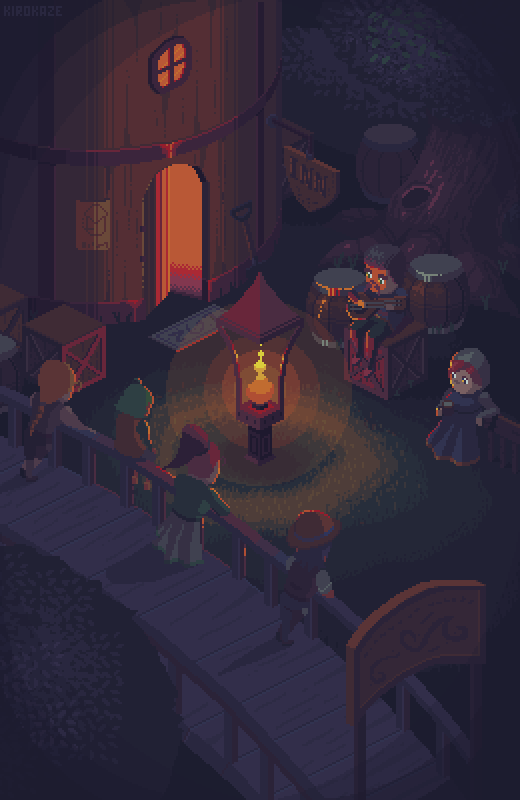

<h1 align="center">Hi 👋, I'm ALI</h1>

  

- 🔭 I’m currently working on **Some Little Project**

- 🌱 I’m currently learning **Back-End & Front-End**

- 💬 Ask me about **! nothing**

- 📫 How to reach me **noobmater69.tnt@gmail.com**

- ⚡ Fun fact **TNT**

## 🌐 Socials:
 

# 💻 Tech Stack:
      
# 📊 GitHub Stats:
 
 

---

---